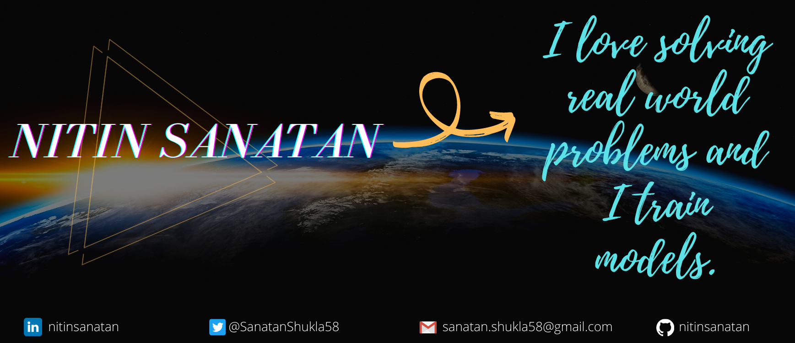

### Hey there 

My name is Nitin and I am a undergrad from India. I have a deep interest in Artificial Intelligence. I love interacting with humans and machines.

## Contact me  [![Twitter][1.2]][1]  [![LinkedIn][2.2]][2]

<!-- Icons -->

[1.2]: http://i.imgur.com/wWzX9uB.png
[2.2]: https://raw.githubusercontent.com/MartinHeinz/MartinHeinz/master/linkedin-3-16.png

<!-- Links to your social media accounts -->

[1]: https://twitter.com/SanatanShukla58
[2]: https://www.linkedin.com/in/nitinsanatan/

<!--
**nitinsanatan/nitinsanatan** is a ✨ _special_ ✨ repository because its `README.md` (this file) appears on your GitHub profile.

Here are some ideas to get you started:

- 🔭 I’m currently working on ...
- 🌱 I’m currently learning ...
- 👯 I’m looking to collaborate on ...
- 🤔 I’m looking for help with ...
- 💬 Ask me about ...
- 📫 How to reach me: ...
- 😄 Pronouns: ...
- ⚡ Fun fact: ...
-->
